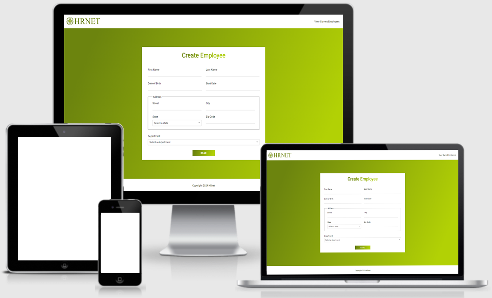

# Projet n°15 : Passer une librairie jQuery vers React

## :mag: Aperçu

## :bookmark_tabs: Sommaire

<ol>
    <li><a href="#sujet">Sujet</a></li>
    <li><a href="#demandes_respecter">Demandes à respecter</a></li>
    <li><a href="#objectifs_projet">Objectifs du projet</a></li>
    <li><a href="#technologies_utilisees">Technologies utilisées</a></li>
    <li><a href="#prerequis">Prérequis</a></li>
    <li><a href="#installation">Installation</a></li>
    <li><a href="#utilisation_siteweb">Utilisation du site web</a></li>
    <li><a href="#auteurs_contributeurs">Auteurs et contributeurs</a></li>
    <li><a href="#licence">Licence</a></li>
</ol>

## :page_facing_up: 1. Sujet 

Vous travaillez pour le département technologique d'une grande société financière, WealthHealth.

Cette société utilise une application web interne, appelée HRnet, qui gère les dossiers des employés.

L'application est ancienne et utilise jQuery côté front end, ce qui entraîne des bugs considérables et une augmentation des plaintes en interne.

Votre équipe de développement s'efforce depuis un certain temps déjà de mettre à niveau l'application.

## :memo: 2. Demandes à respecter 

-   Faire évoluer l'application web statique qui n'utilise que HTML, CSS, JavaScript / jQuery, en une application web dynamique, en utilisant React, React Router, et Sass ;
-   Utiliser Redux ToolKit pour gérer l'état de l'application ;
-   Développer un des plugins présents dans la version statique de l'application web sous la forme d'une librarie npm réutilisable.

## :checkered_flag: 3. Objectifs du projet 

-   Apprendre à utiliser React, React Router, Redux ToolKit ;
-   Apprendre à créer une librairie npm réutilisable.

## :computer: 4. Technologies utilisées 

-   HTML
-   CSS / Sass
-   JavaScript / React.js
-   Redux / Redux Toolkit
-   Npm
-   Git & GitHub

## :exclamation: 5. Prérequis 

Aucun

## :wrench: 6. Installation 

-   Cloner ce repository.
-   Pour installer les différents packages, dans le terminal à partir du dossier front-end, exécuter npm install.

## :question: 7. Utilisation du site web 

-   Dans le terminal à partir du dossier front-end, exécuter npm start ;
-   La documentation sur le plugin modal / librairie npm développé est disponible ici : https://www.npmjs.com/package/timlancelle-react-modal?activeTab=readme

## :beers: 8. Auteurs et Contributeurs 

Timoté Lancelle : [GitHub](https://github.com/LancelleTimote) / [LinkedIn](https://www.linkedin.com/in/timote-lancelle-devweb/)

## :page_with_curl: 9. Licence 

Distribué sous la licence MIT. Voir le fichier [LICENSE](LICENSE) pour plus d'informations.
